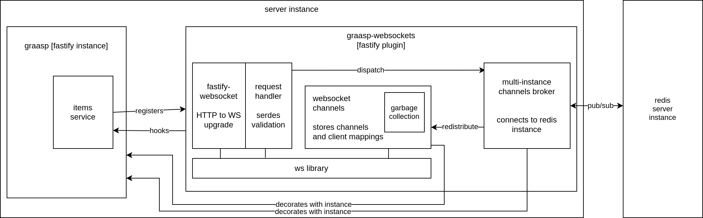
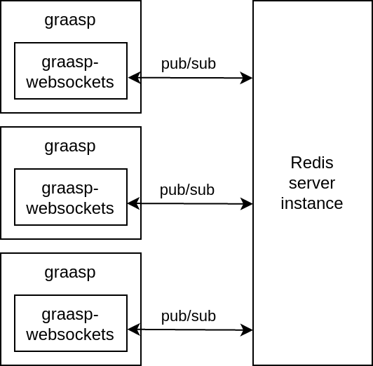

<!--
    compilation :
    pandoc -V geometry:margin=2.5cm --variable urlcolor=cyan --number-sections -o report.pdf report.md
-->

---
header-includes:

 - \usepackage{fancyhdr}
 - \usepackage{multicol}
 - \usepackage{graphicx}
 - \pagestyle{fancy}
 - \fancyhead[CO,CE]{graasp-websockets}
 - \fancyfoot[CO,CE]{Alexandre CHAU - EPFL - REACT}
 - \fancyfoot[LE,RO]{\thepage}
 - \newcommand{\columnsbegin}{\begin{multicols*}{2}}
 - \newcommand{\columnsend}{\end{multicols*}}
---

\begin{titlepage}
	\centering
	\includegraphics[width=0.25\textwidth]{img/epfl-logo.png}\par
    {Interaction Systems Group (REACT)\par}
	\vspace{2.5cm}
	{\scshape\Large Master semester project\par}
	\vspace{1.5cm}
	{\huge\bfseries graasp-websockets\par}
	\vspace{0.5cm}
    {Real-time content change notifications in a web-based service\par using a full-duplex communication channel\par}
	\vspace{2cm}
	{\Large Alexandre CHAU\par}
	\vfill
	supervised by\par
	{\Large Dr. Denis \textsc{Gillet}\par}
	{\Large Dr. Nicolas \textsc{Macris}\par}
    {\Large André \textsc{Nogueira}\par}

	\vfill
	{\large \today\par}
\end{titlepage}

\tableofcontents

\newpage

# Abstract

*Graasp* is a social media learning platform that provides an ecosystem of software applications for digital education. It is developed by the Coordination & Interaction Systems Group (REACT) at EPFL.

In late 2019, a major overhaul of the *Graasp* web software stack was initiated using state-of-the-art technologies. This modernization allows for the adoption of recent open standards such as WebSocket, which in turn enables the implementation of new classes of features including real-time bidirectional communications between clients and server.

This project provides real-time content change notifications in *Graasp* web-based services
using the WebSocket protocol as a full-duplex communication channel.

**Keywords**: WebSocket, Digital Education, Graasp Platform

# Introduction

*Graasp* provides a social media platform for teachers and students in primary, secondary school and higher education that supports collaborative learning, personal learning and inquiry learning. It aims at providing digital tools for education that resemble social media services which feature web-based applications, user-generated content, service-specific profiles and social networks: "the need to provide a versatile and agile social media platform strengthening digital education has emerged. The main features of such a platform mimicking the social media solutions people are using daily include the ability (i) to create online spaces targeting dedicated learning activities by aggregating resources from various cloud or local sources, (ii) to share these spaces with peers (either teachers or students), (iii) to exploit these spaces by interacting with the integrated resources, available tutors, and collaborating peers, as well as (iv) to archive these spaces together with the learning outcome (produced artifacts) for later use or as proof of personal achievements in lifelong learning." (Gillet et al. 2016)

Starting in 2019, the *Graasp* web software was rewritten to refactor and consolidate its codebase (thereafter referred to as *Graasp v3*) with modern technologies, both on the back-end server side (with tools such as the NodeJS runtime and the Fastify web framework) and in front-end user applications (with e.g. the ReactJS user interface library and ECMAScript 2015). Browser vendors and open standards organizations (e.g. W3C, IETF) also evolved web browsers and Internet protocols into intercompatible systems based on open standards with richer feature sets. In particular the WebSocket protocol was introduced which "enables two-way communication between a client running untrusted code in a controlled environment to a remote host that has opted-in to communications from that code." (RFC 6455)

This allows web applications running in client browsers to keep interacting with (and receiving data from) the server even after the initial request was answered, and without the need for the client to initiate another transaction. In the context of *Graasp*, new features can be developed using this technique. In particular, we are interested in providing real-time notifications that reflect state changes that occured on the server (for instance a document created by a user) directly to all affected clients (such as another user that is currently watching the folder in which the document was created). Real-time notifications can also inform users when unexpected errors occur (e.g. a database server crashing) immediately. Otherwise, the client user would have to wait until he/she performs another action (refreshing the page, clicking on a button) to trigger a new request and then obtain the updated response / error.

WebSocket is thus particularly well-suited for that purpose, as it allows the server to push such notifications directly to connected clients. Other suboptimal techniques (e.g. polling) could also be used, but they consume network resources even when no new state is available.

## Previous work

Preliminary prototypes for real-time content changes were implemented in *Graasp* using Socket.IO, an event-based communication library built on top of WebSocket and HTTP long polling. However, several limitations eventually led to Socket.IO being discarded:

- **Lack of compatibility**: Socket.IO implements a non-standardized layer of abstraction above WebSocket. As such, clients cannot connect to a Socket.IO server without the corresponding client Socket.IO library, and Socket.IO is not directly compatible with native WebSockets. A client implementation of Socket.IO must exist for every existing platform; even though Java, C++, Swift, Dart, Python and .Net versions are available, this limitation would prevent the Graasp ecosystem to grow outside of these languages.

- **Lack of integration with Fastify**: Authentication through Fastify on Socket.IO resources (such as "rooms") proved to be difficult. In particular, cookie exchanges led to unexpected behaviours.

- **Library size**: The server library of Socket.IO weighs 1.03 MB ([npm](https://www.npmjs.com/package/socket.io)), while the minified client library has a size of 62.77 KB ([cdnjs](https://cdnjs.cloudflare.com/ajax/libs/socket.io/4.1.1/socket.io.min.js)). By using native WebSockets from the client side instead, no additional library is required or downloaded.

Hence the notification delivery system in *Graasp v3* requires a domain-specific real-time protocol based on native WebSockets.

## Contributions

This project provides a WebSocket-based solution for real-time delivery of content to specific clients, which can be plugged into the core *Graasp* server code through a single function call. The code is available as an open-source repository on Github ([graasp/graasp-websockets](https://github.com/graasp/graasp-websockets)) with an associated toolchain and continuous integration running on Github Actions. In addition, a client-side API is provided for a sample front-end application (graasp-compose). The code is modularized such that independent components can be reused for different purposes (even unrelated to *Graasp*).

\newpage

# Implementation

## Requirements

The purpose of this project is to abstract global broadcast (i.e. server to all clients) and channel broadcast (i.e. server to specific groups of clients given some identifer) operations over an entire distributed network of computers (with any number of clients and servers) using only point-to-point websocket connections between each client and the server.

To do so, we define a custom, domain-specific protocol for messages that are exchanged over WebSocket. We provide additional data structures and logic to handle channels, stateful connections, garbage collection, and distribution over many servers.

## Back-end: graasp-websockets

### Tooling

The *Graasp v3* rewrite is based around a core server that handles the essential abstractions required in the *Graasp* applications ecosystem (e.g. users, or items which represent learning resources). The *Graasp* core is written in Typescript, runs on the NodeJS runtime, and uses the [Fastify](https://www.fastify.io/) web framework to serve client requests over an HTTP JSON REST API.

`graasp-websockets` depends on the following libraries and technologies:

- [NodeJS](https://nodejs.org/en/): a standalone Javascript runtime environment for multipurpose computing
- [Typescript](https://www.typescriptlang.org/): a high-level language that extends Javascript with types
- The *Graasp v3* core Fastify server instance (graasp/graasp)
- [ws](https://github.com/websockets/ws): a low-level WebSocket server library and the [fastify-websocket](https://github.com/fastify/fastify-websocket) adapter
- [AJV](https://ajv.js.org/): a JSON validation library
- [Redis](https://redis.io/): an in-memory data structures server used to provide state replication across multiple *Graasp* core instances (when distributing load) and the [ioredis](https://github.com/luin/ioredis) client library
- [Jest](https://jestjs.io/): a Javascript testing library and [ts-jest](https://kulshekhar.github.io/ts-jest/) a Jest transformer for Typescript

### System architecture

Fastify instances can be extended through plugins. A plugin is a function that takes the Fastify server instance as input and registers any additional behavior or state on the instance as a side-effect. This allows a clean separation of concerns, as any additional related group of features in *Graasp* can be added as another plugin.

`graasp-websockets` is implemented as a Fastify plugin that interacts with services attached to the core server instance that can provide real-time updates, such as the items service that handle persistence changes in resources storage.

The plugin is composed of several independent modules. They are reflected in the files hierarchy of the `src/` folder:

- **service-api.ts**: the entry point that exports the plugin function. It defines the HTTP routes on which clients can upgrade their connections to WebSocket, performs authentication, validation and deserialization on the incoming requests (HTTP and WebSocket), instantiates the other modules and registers *Graasp*-specific interactions with WebSocket. For instance, it dispatches the events from the items service to related clients through WebSocket.

- **ws-channels.ts**: it defines the data structures that represent a WebSocket client, as well as channels which represent *rooms* or *topics* that clients can *subscribe to*. Messages sent (*published*) on a given channel are received by all clients subscribed to it, and none others. Clients can subscribe to specific channels by sending WebSocket request messages to the service API. This module implements the WebSocket channels management abstraction, which allows the creation and deletion of channels, the dispatch of messages over specific channels, and also provides functions for the clients to (un-)subscribe (from) to given channels through the service API. It also implements garbabe collection as a heartbeat mechanism: since barebone WebSockets do not detect broken collections, the channels abstraction would otherwise always leak memory and keep accepting new connections until the server runs out of memory. Instead, it periodically sends ping messages to clients (as described in the WebSocket specification) and destroys the instances of the ones that do not reply. Similarly, it can remove empty channels as a pessimistic optimization, which ensure that only clients and channels that currently exist are being used and allowed to occupy server resources. The relationship between clients and channels is kept in 2 synchronized maps for performance: one maps each channel to its client subscribers, and the other each client to its channel subscriptions.

- **multi-instance.ts**: this module allows multiple instances of the *Graasp v3* core to co-exist while maintaining a global publish-subscribe relationship between any server and client pair. This is useful when multiple copies of the server run in parallel (for instance for load balancing purposes). It provides a message format and serialization / deserialization for Redis, and uses the [Redis Pub/Sub](https://redis.io/topics/pubsub) interface to relay message across instances. It thus exposes a message broker for any instance to dispatch a message among all servers. Since each instance is also subscribed to the same Redis channel itself, modules that use this message broker do not need to send WebSocket messages through the channels abstraction directly: they can send it through the broker, which will receive it again itself, and redistribute it in the corresponding channel through the channels abstraction to its own clients. As a corollary, channels thus do not need to exist ahead-of-time, and they do not need to exist on all instances simultaneously. Only instances that have active subscriptions to the given specific channel will hold its representation in memory, which can be created on-the-fly when the first client requests the given channel, and be destroyed as soon as none of its own clients are subscribed to it anymore, irrespective of other instances and their connected clients.

{#id .class width=200px}

- **interfaces/message.ts** and **schemas/message-schema.ts**: these interfaces describe the shape of all possible messages exchanged between the server and its clients. In sum, they specify the message format of the application-specific protocol that is used over WebSocket. For instance, clients may send "subscribe" messages as specified in the `ClientSubscribe` message definition. Schemas describe these exact same shapes when serialized into JSON using [JSON Type Definitions (JTD)](https://ajv.js.org/json-type-definition.html).

- **impls/message-serializer.ts**: the above equivalent definitions allow the AJV library to compile efficient parsers, validators and serializers for the corresponding object types, which are more performant than generic solutions such as `JSON.parse`.

## Front-end: graasp-compose

# Future work

# Conclusion

# References

1. Denis Gillet, Andrii Vozniuk, Maria Jesus Rodriguez Triana, and Adrian Christian Holzer. 2016. *"Agile, Versatile, and Comprehensive Social Media Platform for Creating, Sharing, Exploiting, and Archiving Personal Learning Spaces, Artifacts, and Traces"*. [http://infoscience.epfl.ch/record/221529](http://infoscience.epfl.ch/record/221529)

2. Alexey Melnikov and Ian Fette. Melnikov, Alexey, and Ian Fette. 2011. 
*“The WebSocket Protocol”*. Request for Comments. RFC 6455. [https://doi.org/10.17487/RFC6455](https://doi.org/10.17487/RFC6455)

3. *Socket.IO*. Accessed on 2021-06-11. [https://socket.io/](https://socket.io/)

4. *Fastify*. Accessed on 2021-06-11. [https://www.fastify.io/](https://www.fastify.io/)

5. *Redis Pub/Sub*. Accessed on 2021-06-11. [https://redis.io/topics/pubsub](https://redis.io/topics/pubsub)